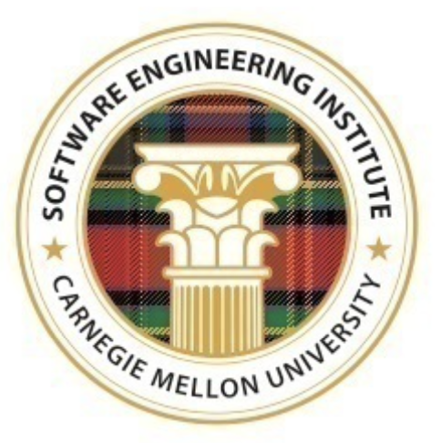
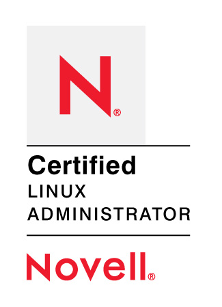
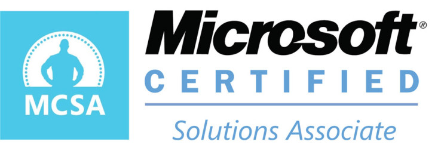
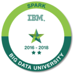
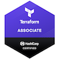

# Anton Pohorilyi

## Contact Info
* phone: 737-280-6309
* e-mail: pogiant@gmail.com

## Summary
Platform architect with strong infrastructure and cloud background. DevOps, SRE and cloud-native practices and principles believer, passionate leader that builds and guides teams to solve complex problems.

## Education
**Kyiv National Economics University**  
Master Degree in Law  
Kyiv, Ukraine, Sep 1997 - Jun 2002  

**Kvazar-Micro Education Centre**  
IT Courses  
Kyiv, Ukraine, Mar 2004 - Dec 2004  

## Experience
### _Staff Infrastructure Engineer: TechLead_ @ [OJO Labs](https://ojolabs.com)  
Austin, TX, USA  
February 2020 - Current
#### Project: Core Infrastructure
#### Key Deliverables:
* New core infrastructure design, buildup and migration;
* Monitoring refactoring;
* Best practices IaC design and implementation;
* CI/CD infrastructure design and implementation;
* Secrets management solution design and implementation;
* Kubernetes clusters management.

#### Tools and technologies:
AWS, Kubernetes, Terraform, Helm, GitLab, Datadog, Vault

### _Sr. DevOps/SRE Engineer: AI Infrastructure_ @ [Intel Corporation](https://intel.com)  
Austin, TX, USA  
May 2020 - February 2020
#### Project: Scalable AI Cluster Buildup
#### Key Deliverables:
* On-prem infrastructure deployment;
* Core network infrastructure design;
* CI/CD infrastructure design and implementation;
* Secrets management solution design;
* Kubernetes clusters deployment.

#### Tools and technologies:
MaaS, Ansible, Kubernetes, Jenkins X, Vault

### _DevOps Architect_ @ [Softserve Inc.](https://softserveinc.com)  
Austin, TX, USA  
Jun 2019 - May 2020
#### Project: International Real Estate Franchise
#### Key Deliverables:
* Build, mentor and guide DevOps team;
* Infrastructure performace improvements;
* Secrets management solution design;
* Infrastructure change promotion and monitoring redesign;
* CI/CD pipeline design and implementation;
* Database sharding with Vitess.

#### Tools and technologies:
GCP, Terraform, Kubernetes, Kong, CircleCI, Spinnaker, Vault, LightStep

### _DevOps Architect_ @ [Softserve Inc.](https://softserveinc.com)  
Austin, TX, USA  
Sep 2018 - Jun 2019  
#### Project: Cloud Plaftorms Partnership
#### Key Deliverables:
* Proposals preparation with all different parties, stakeholders and workflows;
* Estimation and scope decomposition;
* Risk assessment, defining dependencies and assumptions;
* Technical specifications and architecture vision document creation;
* Participation in discovery phases and workshops.

#### Tools and technologies:
GCP, Terraform, Kubernetes, Istio, Jenkins X, Helm, Vault

### _DevOps Architect_ @ [Softserve Inc.](https://softserveinc.com)  
Austin, TX, USA  
Sep 2018 - Jun 2019  
#### Project: Single Sign-On Enterprise Platform
#### Key Deliverables:
* New CI/CD Pipelines design;
* Transform to Infrastructure as a Code (IaaC) model;
* Infrastructure assasement and improvements recommendations;
* Service Mesh improvements.

#### Tools and technologies:
AWS, Terraform, Kubernetes, Linkerd, Cassandra, Kafka, Jenkins, Vault

### _DevOps Architect_ @ [Softserve Inc.](https://softserveinc.com)  
Austin, TX, USA  
Mar 2016 - Sep 2018  
#### Project: Recommendations and Advertising Platform
#### Key Deliverables:
* Big data jobs automation via Data Pipeline;
* Data/Indexing stack management;
* Streaming data platform management;
* Deployment automation;
* Performance tuning.

#### Tools and technologies:
AWS, Cassandra, Storm, Kafka, Spark, CoreOS Rkt, Docker, Jenkins, Scala

### _DevOps TechLead_ @ [Softserve Inc.](https://softserveinc.com)
Dnipro, Ukraine - Austin, TX, USA  
Nov 2014 - Mar 2016
#### Project: Data Services
#### Key Deliverables:
* Docker infrastructure design and implementation;
* Services migration to Docker;
* Data/Indexing stack management;
* Monitoring refactoring;
* Performance testing framework build;
* Deployment automation.

#### Tools and technologies:
AWS ECS, Docker, Consul, Zookeeper, MongoDB, Datadog, Python/Ruby, Jenkins, Dropwizard, Java

### _Sr. DevOps Engineer_ @ [Softserve Inc.](https://softserveinc.com)
Dnipro, Ukraine  
May 2013 - Nov 2014
#### Project: Web Platform
#### Key Deliverables:
* Log Management and Analysis System deployment;
* Data/Indexing stack management;
* Web application migration;
* High-loaded web platform support (over 500 millions unique visitors);
* Deployment automation.

#### Tools and technologies:
AWS CloudFormation, RDS, SQS, ELB, etc.; Elasticsearch, Logstash, Cassandra, Nginx, Java applications, Python, Puppet, Jenkins, Gatling

### _DevOps Engineer_ @ [Softserve Inc.](https://softserveinc.com)
Dnipro, Ukraine  
Dec 2010 - May 2013
#### Project: Web Platform
#### Key Deliverables:
* Custom Solr sharding and clustering deployment;
* Consistent MySQL snapshots platform;
* Cloud-based Europe cluster launch;
* TUV audit preparation (McAfee MySQL audit plugin deployment, centralized logging, security fixes).

#### Tools and technologies:
AWS EC2, MySQL, Tomcat, HAProxy, Java applications, Bash, Puppet, Rsyslog

### _Instructor_ @ [IT Academy "Step"](https://itstep.org/en)
Dnipro, Ukraine  
Aug 2005 - Nov 2010
#### Project: Private Education
#### Key Deliverables:
* Systems administration and networking trainings;
* Cisco Academy courses;
* Microsoft IT Academy training;
* On-line courses developing.

#### Tools and technologies:
Cisco Appliances, Microsoft Windows, Linux, etc.

### _System Administrator_ @ [Kvazar-Micro](http://www.kmcore.com/en)
Dnipro, Ukraine  
Aug 2004 - Nov 2005
#### Project: IT
#### Key Deliverables:
* Systems administration and network support

## Skills
### Software Development Methodologies
* Kanban, Agile, Scrum, XP
* DevOps

### Operating Systems
* Microsoft Windows Server NT - 2008R2
* Linux
* Solaris OS

### DevOps Tools
* Core system services: LDAP, DNS, DHCP, WINS, FTP, Samba, NFS, Squid, Postfix, etc.
* Networking: strong TCP/IP knowledge
* Application services: Tomcat, Dropwizard
* Security services: OpenVPN, VNC, OpenSwan, SSH, SSL, Vault
* Virtualization platforms: Vmware, Hyper-V, Xen, Vserver
* Security appliances: Cisco PIX, Cisco ASA, F5 LB
* HA/Load balancing: F5 LB, HAProxy, Nginx, MysqlProxy, AWS ELBs
* CI/CD: Jenkins, TeamCity, GitLab, CircleCI, Travis CI, Spinnaker, Jenkins X
* Version Control: SVN, Git
* Monitoring: Nagios, Zabbix, Datadog, New Relic, LightStep, Prometheus
* Automation: Puppet, Salt, Ansible
* Orchestration: Rundeck, MCollective
* Containers: Docker, Kubernetes, Helm, Kustomize, CoreOS Rkt
* IaaC: AWS CloudFormation, Terraform
* Service Mesh: Linkerd, Istio, Kuma
* API Gateways: Kong, Apigee, AWS API Gateway
* Log management and analysis: Rsyslog, Splunk, Sumo Logic, Elastic Stack
* AWS Cloud: EC2, VPC, S3, CloudFormation, CloudWatch, SNS, SQS, Route53, ECS, RDS, EMR, DataPipeline, CodeDeploy, Lambda
* Google Cloud: Compute Engine, App Engine, Kubernetes Engine, Cloud Storage, Cloud Datastore, Stackdriver
* Search Engines: Solr, Elasticsearch
* Discovery services: Consul, Etcd, Zookeeper
* Big Data Tools: Kafka, Storm, Spark, Hadoop, Hive
* Bare Metal Automation: MaaS, Juju, MetalLB

### Databases
* MS SQL Server 2000/2005
* MySQL
* PostgreSQL
* Cassandra
* MongoDB
* Redis

### Languages
### Scripting
* Bash/Python/Ruby

### Debugging
* Java/Scala/Go/JS/PHP

## Certificates
[Software Architecture Principles and Practices](https://github.com/apogoryelyi/cv/blob/master/certificates/SAPP_Completion%20Certificate%20v1.pdf)   
SEI SAPP, Carnegie Mellon University, Jul 2019  
  
[Documenting Software Architectures](https://github.com/apogoryelyi/cv/blob/master/certificates/SEI_DSA_Completion%20Certificate%20v1.pdf)  
SEI DSA, Carnegie Mellon University, Aug 2019  
  
[Google Cloud Certified Cloud Architect - Professional](https://github.com/apogoryelyi/cv/blob/master/certificates/GCP.pdf)  
Google Cloud, License 11592441, May 2018  
  
[AWS Certified Solutions Architect - Associate](https://github.com/apogoryelyi/cv/blob/master/certificates/ASAA.pdf)  
Amazon License AWS-ASA-4813, November 2014  
  
[Novell Certified Linux Administrator](https://github.com/apogoryelyi/cv/blob/master/certificates/NCLA.png)  
Novell, November 2009  
  
[Cisco Certified Network Professional](https://github.com/apogoryelyi/cv/blob/master/certificates/CCNP.png)  
Cisco, License 403670571638ILBF, November 2009  
  
[Kerio Certified Technical Professional](https://github.com/apogoryelyi/cv/blob/master/certificates/KCTP-KWF.png)  
Kerio Technologies, July 2011  
  
[Microsoft Certified Solutions Associate](https://github.com/apogoryelyi/cv/blob/master/certificates/MCSolA.pdf)  
Microsoft, April 2012  
  
[Microsoft Certified Systems Administrator - Security](https://github.com/apogoryelyi/cv/blob/master/certificates/MCSA-Security.png)  
Microsoft ,November 2008  
  
[Programming for Everybody (Python)](https://github.com/apogoryelyi/cv/blob/master/certificates/CPL.pdf)  
Coursera, December 2014  
  
[Spark - Level 2](https://github.com/apogoryelyi/cv/blob/master/certificates/BD0212EN.pdf)  
Big Data University, December 2016  
  
[HashiCorp Certified: Terraform Associate](https://www.youracclaim.com/badges/ee4a680e-affd-4127-a3c7-547a8171b059)  
HashiCorp, September 2019  
  

## Honors and Awards
### Best Speaker @ [Pacemaker: Ops Conference](http://www.pacemaker.in.ua/OPS-2012/about)
Softserve, Dec 2012
### Best Speaker @ [Pacemaker: Cloud Conference](http://www.pacemaker.in.ua/Cloud-2013/about)
Softserve, Nov 2013
### B: Heroic Award
Bazaarvoice, Award for a great performance, Oct 2014  
### Hackathon 2016 Best Project
R&D Hackathon, Best Project, Dec 2016
### Software Architecture Award - 2018
Softserve, Unit A3, Dec 2018
### Software Architecture Award - 2019
Softserve, Unit A3, Dec 2019
